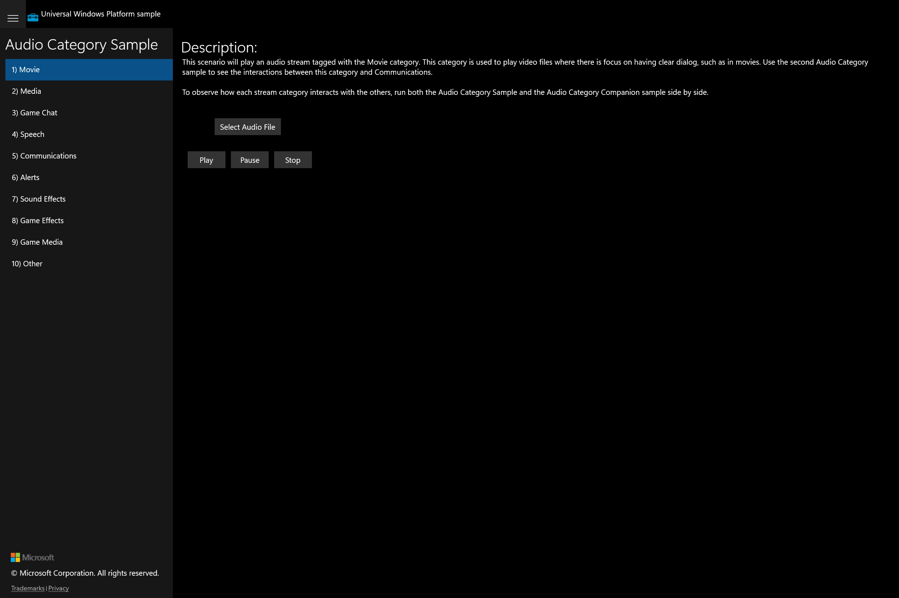

# UWP Feature Rubric - AudioCategory

**Scenario:** AudioCategory
**UWP capture status:** ok (PID 15288, window `AudioCategory C# sample`)

The Audio Category Sample is a 10-scenario SDK sample. Every scenario shares the same structure:
a button that sets one `MediaPlayerAudioCategory` and opens a file picker, plus a shared
`PlaybackControl` (Play / Pause / Stop + `MediaElement`/`MediaPlayerElement` + status log) and
a descriptive paragraph.
## Audio category scenarios / Movie

**ID:** `scenario-movie`
**Weight:** 1

Plays an audio stream tagged with the 'Movie' audio category.

**Expected behaviour:**
- Navigating to '1) Movie' shows the scenario page with its action button.
- Clicking the category action button sets `MediaPlayerAudioCategory.Movie` and opens a file picker.
- Play / Pause / Stop control playback via the shared PlaybackControl.
- A status TextBlock reports playback / sound-level events.

**UWP reference screenshot:**

## Audio category scenarios / Media

**ID:** `scenario-media`
**Weight:** 1

Plays an audio stream tagged with the 'Media' audio category.

**Expected behaviour:**
- Navigating to '2) Media' shows the scenario page with its action button.
- Clicking the category action button sets `MediaPlayerAudioCategory.Media` and opens a file picker.
- Play / Pause / Stop control playback via the shared PlaybackControl.
- A status TextBlock reports playback / sound-level events.

**UWP reference screenshot:**

## Audio category scenarios / Game Chat

**ID:** `scenario-game-chat`
**Weight:** 1

Plays an audio stream tagged with the 'Game Chat' audio category.

**Expected behaviour:**
- Navigating to '3) Game Chat' shows the scenario page with its action button.
- Clicking the category action button sets `MediaPlayerAudioCategory.GameChat` and opens a file picker.
- Play / Pause / Stop control playback via the shared PlaybackControl.
- A status TextBlock reports playback / sound-level events.

**UWP reference screenshot:**

## Audio category scenarios / Speech

**ID:** `scenario-speech`
**Weight:** 1

Plays an audio stream tagged with the 'Speech' audio category.

**Expected behaviour:**
- Navigating to '4) Speech' shows the scenario page with its action button.
- Clicking the category action button sets `MediaPlayerAudioCategory.Speech` and opens a file picker.
- Play / Pause / Stop control playback via the shared PlaybackControl.
- A status TextBlock reports playback / sound-level events.

**UWP reference screenshot:**

## Audio category scenarios / Communications

**ID:** `scenario-communications`
**Weight:** 1

Plays an audio stream tagged with the 'Communications' audio category.

**Expected behaviour:**
- Navigating to '5) Communications' shows the scenario page with its action button.
- Clicking the category action button sets `MediaPlayerAudioCategory.Communications` and opens a file picker.
- Play / Pause / Stop control playback via the shared PlaybackControl.
- A status TextBlock reports playback / sound-level events.

**UWP reference screenshot:**

## Audio category scenarios / Alerts

**ID:** `scenario-alerts`
**Weight:** 1

Plays an audio stream tagged with the 'Alerts' audio category.

**Expected behaviour:**
- Navigating to '6) Alerts' shows the scenario page with its action button.
- Clicking the category action button sets `MediaPlayerAudioCategory.Alerts` and opens a file picker.
- Play / Pause / Stop control playback via the shared PlaybackControl.
- A status TextBlock reports playback / sound-level events.

**UWP reference screenshot:**

## Audio category scenarios / Sound Effects

**ID:** `scenario-sound-effects`
**Weight:** 1

Plays an audio stream tagged with the 'Sound Effects' audio category.

**Expected behaviour:**
- Navigating to '7) Sound Effects' shows the scenario page with its action button.
- Clicking the category action button sets `MediaPlayerAudioCategory.SoundEffects` and opens a file picker.
- Play / Pause / Stop control playback via the shared PlaybackControl.
- A status TextBlock reports playback / sound-level events.

**UWP reference screenshot:**

## Audio category scenarios / Game Effects

**ID:** `scenario-game-effects`
**Weight:** 1

Plays an audio stream tagged with the 'Game Effects' audio category.

**Expected behaviour:**
- Navigating to '8) Game Effects' shows the scenario page with its action button.
- Clicking the category action button sets `MediaPlayerAudioCategory.GameEffects` and opens a file picker.
- Play / Pause / Stop control playback via the shared PlaybackControl.
- A status TextBlock reports playback / sound-level events.

**UWP reference screenshot:**

## Audio category scenarios / Game Media

**ID:** `scenario-game-media`
**Weight:** 1

Plays an audio stream tagged with the 'Game Media' audio category.

**Expected behaviour:**
- Navigating to '9) Game Media' shows the scenario page with its action button.
- Clicking the category action button sets `MediaPlayerAudioCategory.GameMedia` and opens a file picker.
- Play / Pause / Stop control playback via the shared PlaybackControl.
- A status TextBlock reports playback / sound-level events.

**UWP reference screenshot:**

## Audio category scenarios / Other

**ID:** `scenario-other`
**Weight:** 1

Plays an audio stream tagged with the 'Other' audio category.

**Expected behaviour:**
- Navigating to '10) Other' shows the scenario page with its action button.
- Clicking the category action button sets `MediaPlayerAudioCategory.Other` and opens a file picker.
- Play / Pause / Stop control playback via the shared PlaybackControl.
- A status TextBlock reports playback / sound-level events.

**UWP reference screenshot:**

